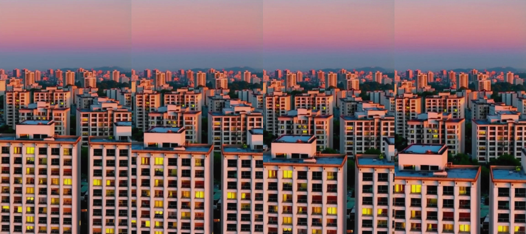
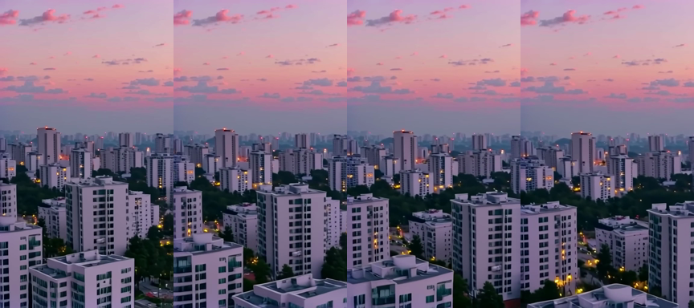
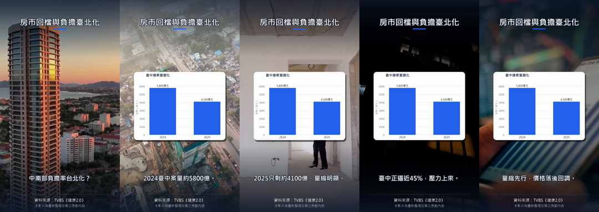
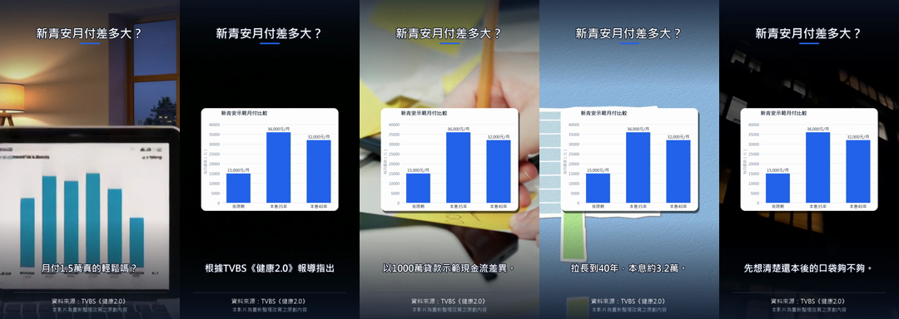

# 成品展示

所有檔案都是流程實際產出，沒有手工修飾。三段 AI 鏡頭用**同一個 prompt**（台北黃昏公寓群、緩慢推進），方便並排比較三個免費 provider。

Prompt：`Slow cinematic push-in over a dense Taipei apartment district at dusk, warm window lights, hazy purple sky, realistic, high detail, no text, no people`

| Provider | 費用 | 實測時間 | 需要什麼 | 影片 | 影格（0 / 1.7 / 3.3 / 5 s） |
|---|---|---|---|---|---|
| `hf` — Hugging Face ZeroGPU（Lightricks 官方 LTX-Video distilled Space） | $0 | 25 秒（有 HF_TOKEN 18–25 秒） | 不用 key；免費帳號 token 額度較大 | [shot_hf_zerogpu.mp4](shot_hf_zerogpu.mp4) |  |
| `pixazo` — Pixazo LTX 免費方案 | $0 | 107 秒 | 免費 key（不用信用卡） | [shot_pixazo.mp4](shot_pixazo.mp4) |  |
| `comfy` — 本機 ComfyUI + LTX-Video 2B distilled | $0 | 107 秒（含首次載入模型；之後 80–90 秒） | GPU（demo：AMD Radeon 8060S 內顯）+ 11.5 GB 模型 | [shot_comfyui.mp4](shot_comfyui.mp4) |  |

觀察：`hf` 與 `comfy` 是同一個模型，畫面風格一致（現代公寓塔樓）；`pixazo` 用的是另一版 LTX，把「台北公寓」畫成傳統街屋、推進更猛——同一個 prompt 在不同 provider 上不保證同樣結果，所以 provider 也是快取 key 的一部分，換 provider 會重生成。

## 完整成品（`data/demo/04_clips/`）

`FINVID_AI_VIDEO=hf,pixazo,comfy` + `FINVID_BROLL=pexels`：AI 開場鏡頭 → 每句一段 Pexels 真實素材 → 圖表卡疊在畫面上，標題／字幕／出處在最上層。

**clip_08「房市回檔與負擔臺北化」**（39 秒，[mp4](../../data/demo/04_clips/clip_08.mp4)）

**clip_05「新青安月付差多大？」**（38 秒，[mp4](../../data/demo/04_clips/clip_05.mp4)）

這一次跑的帳本（`finvid costs --url demo`）：OpenAI 腳本 $0.052（Pass A 快取命中）、AI 鏡頭 3 段共 39 秒 $0、Pexels 23 次搜尋 $0；對照整支用 AI 影片 API 約 $27.5。
